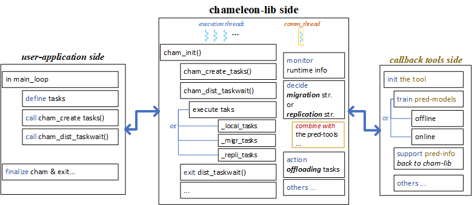
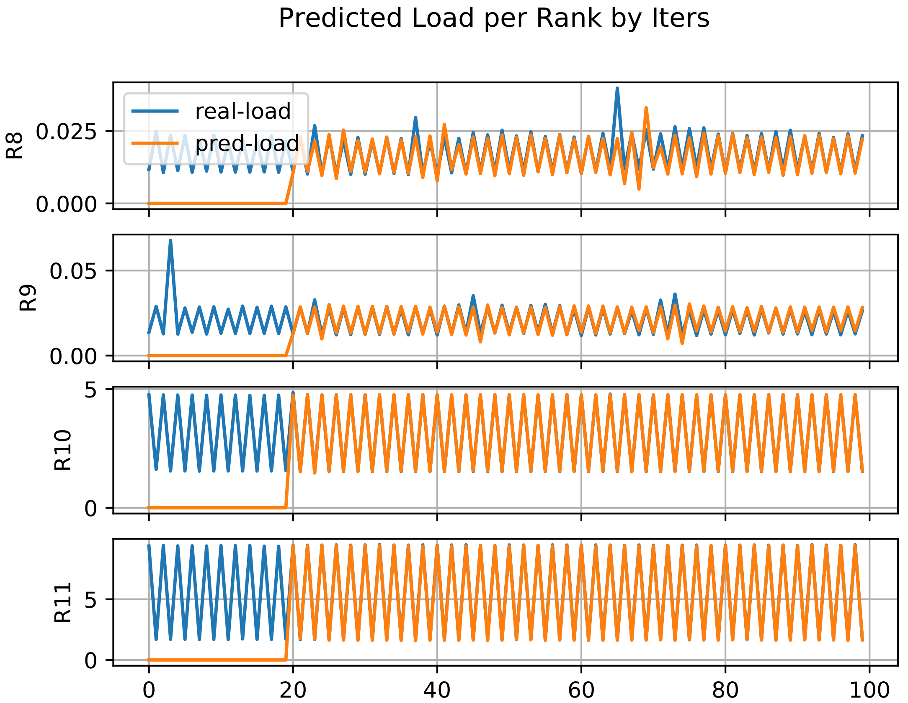

## Chameleon Load Prediction Tool & Proactive Task Offloading Strategy
The document shows how the online prediction scheme and proactive task offloading work. We design the module as a callback tool outside Chameleon depending on domain-specific applications. The examples are illustrated through a synthetic test case (MxM) and an iterative simulation named Sam(oa)2 (adaptive mesh refinement with solving partial differential equations - PDEs).

## Working Flow
<figure>
  
  <figcaption>Fig.1. Working flow of (A) reactive load balancing and (B) proactive load balancing.</figcaption>
</figure>

Fig.1 includes two parts: (A) shows the working flow of reactive load balancing and (B) proactive load balancing with online load prediction and task offloading. In detail, the y-axis indicates information on each rank (i.e., Rank 0, Rank 1); the x-axis highlights the time progress of execution, particularly in iterations (so-called time-steps in iterative applications, each iteration is synchronized by a barrier among ranks). This illustration shows the execution flow with two ranks, two threads per rank for performing tasks and one dedicated thread (`Tcomm`) for doing something else asynchronously. The `green` box points to a local task being executed, while the `yellow` box indicates a remote task which is offloaded from an overloaded process to an underloaded process and also a reactive operation at runtime, e.g., `load_mon` - load monitoring or `react_mig` - reactive task migration. The `purple` box shows proactive operations that are performed on `Tcomm`, e.g., `char` - task characterization, `trainM` - train prediction model at runtime, etc.

For the reactive approach in Fig.1 (A), `Tcomm` on each rank runs along with other threads to continuously monitoring load and doing task migration. The condition of a reactive action is imbalance ratio calculated by monitored information. The `yellow` boxes on Rank 1 represent the remote tasks migrated/offloaded from Rank 0. The idea is based on the monitored information of execution speed/rank to offload tasks if the estimated imbalance ratio of the most current execution status is met. As part of communication overhead and monitored information at the most current status, reactive decisions must be made with a constant number of offloaded tasks and victims at once.

For the proactive approach in Fig.1 (B), `Tcomm` on each rank will train an online load prediction and use it to perform proactive task offloading. To generate load prediction at runtime, `Tcomm` starts characterizing influence features at the first iterations until the iteration which is pre-configured as the time to start training prediction model. Influence features and parameters are defined by users, depending on specific application domains. For example, after Iteration `k` the `trainM` event will be called to train the model; then it will be loaded at Iteration `k+1` and apply the results to our proactive load balancing algorithm as follows.

## An Example with Proactive Task Offloading Algorithm
<figure>
  
  <figcaption>Fig.2. An example with proactive load balancing algorithm on eight ranks.</figcaption>
</figure>

Assuming that the prediction results of iteration `k` are ready, the inputs for our proactive algorithm are Array `L` and `N`, where `N`, `L` indicates the number of local tasks assigned to each rank, and their total load respectively. The size of `N` and `L` is the number of processes/ranks ().

During the algorithm's main loop, we need Array `R` to keep the total load of remote tasks which are executed on the remote ranks, where the size of `R` is still . The tracking table `TB` is declared as an array with the size of , in which its diagonal records the number of local tasks, e.g., `TB[0,0]` shows the number of local tasks in Rank 0. The other elements (from left to right) indicate the number of offloaded tasks, e.g., `TB[0,5]` is the number of tasks that should be offloaded from Rank 0 to Rank 5.

Before the main loop begins, Array `L` will be sorted by load values and stored in a new array . In detail, there are two **loops** for traversing Array  from two directions. The first loop will go through the victims (starting from the 1st element) which have . In the second loop, we traverse each offloader (starting from the last element) who has .  is the load difference between offloader and , while  is the one between a victim and .

To calculate the number of tasks for offloading, we need to estimate the approximate load per task (named ). In the case of predicting load per task, this value is known, e.g., in the experiment of matrix multiplication. In the case of uniform load and predicting the total load per rank, i.e., in Sam(oa)2, we can divide the total predicted load per rank by the number of assigned tasks to that rank. After we have the load per task, we then use the values of  and  to calculate the number of tasks for offloading from an overloaded rank to an underload rank. Particularly, if the offloader has the overloaded value which is `>=` the gap of  at the victim side, we use  and . If the current offloader does not have enough tasks to fill up , we use  and  to calculate the number of offloaded tasks and the next offloader candidate will be traversed.

Fig.2 shows an imbalance case of 8 ranks with uniform tasks. The number of tasks per rank causes the given imbalance. We assume that the prediction information is ready here; the inputs of the proactive algorithm are the total load and the number of tasks assigned to each rank. As we can see in the first step (`Init step`), Array `L` holds the total load and  is the sorted `L`, `TB (8x8)` indicates 8 ranks involved; its diagonal points to the number of local tasks associated with a corresponding rank. After sorting, contains `R0, R1, R6, R7, R2, R3, R4, R5` as the order.
The first loop goes to the victim - `R5`, and the first offloader is `R0`. In this case, we estimate that `R0` should offload 113 tasks to `R5` based on the values of , , . The new load values of `local` & `remote` are updated; the tracking table is also updated by the number of offloaded tasks at the current row (0 for `R0`). In the end, the final loop output shows that `R0` should migrate 64, 96, ... tasks to the corresponding victims (`R1`, `R2`, ...).

## Dependencies
At the current status, there're 2 options for using built-in machine-learning API:
* Pytorch C++ (https://pytorch.org/cppdocs/installing.html)
  * Do not need to install, but we have to link it when compiling the tool (as the sample compile script in the directory `build/`).
  * Note: might have some overhead and issues with Torch C++.
* Mlpack C++ (https://www.mlpack.org/getstarted.html) [`recommended`]
  * Need to install with the dependencies (Armadillo, Boost, ensmallen)
  * We can follow here https://www.mlpack.org/doc/mlpack-3.4.2/doxygen/build.html

## Package organization
The module is organized as follow:
* `build/`: a sample script to link and build the tool with Chameleon (`TODO`: need to adapt dependencies at your side).
* `chameleon_patch/`: the src-code of the Chameleon lib (latest version) with some changes to fit the prediction tool. For compiling, we just need to replace these files in this patch with the original Chameleon.
* `mlpack_utils/`: some examples with mlpack library to build the regression models.
* `python_utils/`: some examples with scikit-learn/mlpack lib in Python, to build and test the regression models.
* `src/`: the src-code of the tool.

## Different Configurations with Prediction Tool and Proactive Task Offloading
The tool works as the plugin of Chameleon lib (like the event-based working flow). There are callback events defined to override the Chameleon internals.

<p align="left">
  
</p>

For example, the figure above shows the main internals that we can interfere with, e.g., `cham_create_tasks()` for getting task's arguments information. Furthermore, we can completely insert external actions like loading the prediction results before a new execution phase of tasks is processed by calling `cham_dist_taskwait()`. Therefore, the dedicated thead can be used to train a prediction model along with the main execution, then adapt the results to our proactive algorithm.

There are several modes for training prediction models and loading to the proactive task offloading algorithm as follows (whic are defined in `/chameleon_patch/chameleon_common.h`).

``` CXX
#ifndef CHAM_PREDICTION_MODE
#define CHAM_PREDICTION_MODE 0      // no prediction
// #define CHAM_PREDICTION_MODE 1   // total load prediction per iteration, and predict the next iterations by the current load of previous ones
// #define CHAM_PREDICTION_MODE 2   // total load prediction per iteration, and use the predicted-values to input the prediction of next iterations
// #define CHAM_PREDICTION_MODE 3   // load prediction per a single task based on its characteristics, e.g., input arguments
#endif

#ifndef CHAM_PROACT_MIGRATION
#define CHAM_PROACT_MIGRATION 0 // just load the prediction results, do not apply to proactively offload tasks
// #define CHAM_PROACT_MIGRATION 1 // load the prediction results iter-by-iter, and adapt them to proactively offload tasks
// #define CHAM_PROACT_MIGRATION 2 // load the prediction results for the whole future, then adapt them to proactively offload tasks
#endif

// If the offload-task-separately flag is 1, tasks are offloaded by the first strategy (round-robin fashion). Otherwise, tasks are packed into a single package and send at once to the victim.
#ifndef OFFLOAD_SEND_TASKS_SEPARATELY
#define OFFLOAD_SEND_TASKS_SEPARATELY 0
#endif

#endif
```

## Compiling The Tool
There are some sample scripts for compiling the tool in the directory `build/`. But notably, we need to adapt the dependencies installed in our own environment that are declared in CMakeLists.txt.

## Compiling Chameleon & Linking with The Tool
To run Chameleon with the exteral tool, we need to indicate where is the shared library (`.so`) of the tool. In general, there're some steps:
* Copy and overwrite the original version of Chameleon source with the code files in `chameleon_patch/`.
* Loading dependencies: libffi, hwloc, and the corresponding compiler (e.g., Intel).
* Set env-flags for the tool:
  * CHAMELEON_TOOL=1
  * CHAMELEON_TOOL_LIBRARIES=/path/to/the-compiled-tool (.so)
* Regarding the Chameleon-lib internal flags (as migration, replication modes), please set:
  * -DENABLE_COMM_THREAD=1 -DENABLE_TASK_MIGRATION=0 -DCHAM_REPLICATION_MODE=0 -DCHAM_PREDICTION_MODE=2 -DCHAM_PROACT_MIGRATION=2 -DOFFLOAD_SEND_TASKS_SEPARATELY=1
  * For different modes of the prediction tool and proactive task offloading, we just need to change the values of these compile variables.

## Test The Tool & Chameleon
Currently, the examples are `MxM` and `Sam(oa)2` with the simulation of oscillating lake.

## Evaluate The Online Prediction Tool
The current usecase is Samoa-ADERDG-OPT (https://gitlab.lrz.de/samoa/samoa/-/tree/ADER-DG-opt) with Oscillating-Lake scenario. The following test was performed on CoolMUC2 (LRZ), 16 nodes, 2 ranks per node, 14 threads per rank. The line charts show the comparison between real and predicted load. Where, the simulation was run with 100 time-steps, i.e., R8 to R11 are shown below, the results of other ranks could find in `/python_utils/figures/`.
<p align="left">
  
</p>
