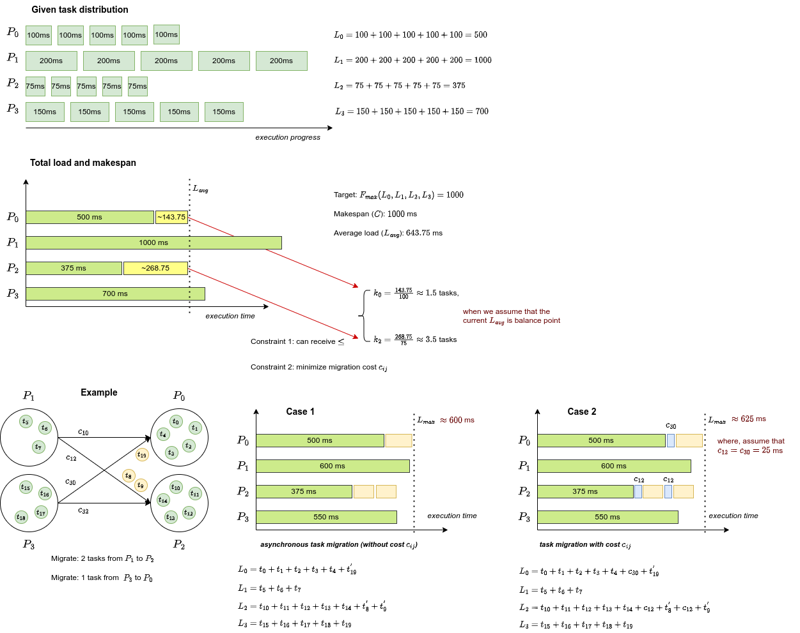

## Rebalancing Problem

* Formulation by Aggarwal et al. [SPAA-06]
    + Given $n$ jobs with the following sizes $\{s_{1}, s_{2}, ..., s_{n}\}$
    + Assigned on $m$ processors $\{P_{1}, P_{2}, ..., P_{m}\}$
    + Problem: relocating jobs among the processors to minimize the makespan, where
        - $makespan$: the completion time of all processors
        - relocating cost: $c_{ij}$ when moving a job from processor $i$ to processor $j$

* Re-formulating and mapping the problem to load rebalancing for task-based parallel applications in HPC
    + Given $n$ similar tasks in total, with the following execution time (load) $\{t_{0}, t_{1}, ..., t_{n-1}\}$
    + Assigned on $m$ processes (processors) $\{P_{0}, P_{1}, ..., P_{m-1}\}$
    + Problem: load imbalance among processes due to performance slowdown, need to relocate tasks or migrate tasks, where we also aim to minimize makespan,
        - $makespan$: the completion time of all processes
        - migration cost: $c_{ij}$ when moving a task from process $i$ to process $j$

* Example: $20$ tasks in total, assigned to $4$ processes, the load values are illustrated as follows.

## Another way to formulate the problem

* Transform to multi-partition problem

* 